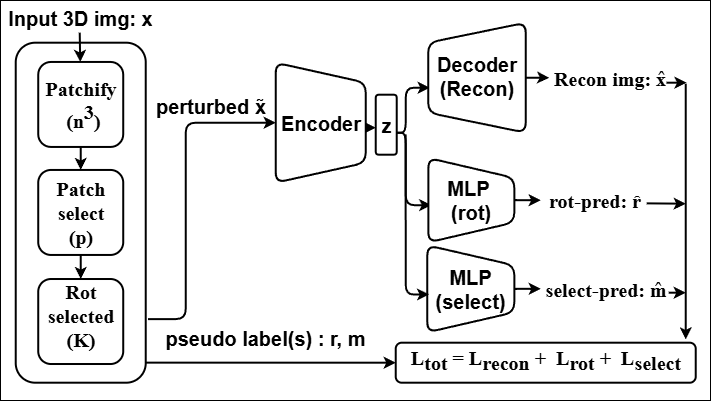
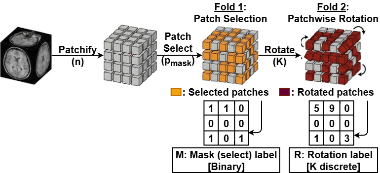

# Two-Fold
Code for "Two-Fold Patch Perturbation for Efficient Self-Supervised Learning in 3D Medical Imaging" published at IJCAI-ECAI 2026

## Abstract
Self-supervised pre-training has become a key
paradigm for reducing annotation costs in 3D medical imaging, yet many recent approaches rely on complex objectives or incur substantial computational overhead. We propose a simple and efficient self-supervised pre-training framework for 3D medical images based on a two-fold patch-wise perturbation strategy. The method applies Bernoulli patch masking and discrete rotations, and trains a shared encoder with a three-head objective for reconstruction, perturbation localization, and rotation prediction. This design encourages spatially aware and transferable representations while remaining computationally lightweight. Experiments across diverse segmentation and classification benchmarks, including modality-shift scenarios, demonstrate consistent improvements over general self-supervised baselines and competitive or superior performance compared to recent medical SSL methods, while requiring substantially less memory, computation, and training time than the state-of-the-art pre-training pipelines.  

<div align="center">

  <figure>
    
    <figcaption>Figure 1: The overall pre-training framework.</figcaption>
  </figure>

  <br>

  <figure>
    
    <figcaption>Figure 2: Two-fold patchwise perturbation strategy.</figcaption>
  </figure>

</div>


## Repository Structure

The codebase is modularized into configurations, execution scripts, and core source code to easily separate pretraining logic from downstream fine-tuning tasks.

```text
.
├── configs/                # YAML configuration files
│   ├── eval/               # configs for evaluating fine-tuned models
│   ├── finetune/           # configs for classification and segmentation tasks
│   └── pretrain/           # configs for self-supervised pretraining
├── scripts/                # Bash scripts to launch DDP training/evaluation
├── src/                    # Core source code
│   ├── common_utils/       # Shared utilities (DDP setup, checkpointing, plotting)
│   ├── finetune/           # Downstream task pipelines
│   │   ├── cls/            # Classification logic (Model, Trainer, Eval)
│   │   ├── seg/            # Segmentation logic (Trainer, Eval)
│   │   └── utils/          # Task-specific dataloaders and transforms
│   └── pretrain/           # Unsupervised pretraining pipeline
│       ├── model/          # SSL architectures (e.g., TwoFold SSL, Heads)
│       ├── utils/          # Patching, custom losses, and pretrain dataloaders
│       ├── main.py         # Pretraining entry point
│       └── trainer.py      # Pretraining loop
└── static/                 # Images and assets for documentation
```
## Usage

The repository is designed to be plug-and-play. All training, fine-tuning, and evaluation runs are controlled via YAML configuration files and launched using pre-configured bash scripts.

### Step 1: Adjust Configurations (Hyperparameters & Datasets)
Before running a script, update the corresponding configuration file inside the `configs/` directory to match your local environment and desired hyperparameters. 

Choose the appropriate YAML file based on your task (`pretrain/`, `finetune/`, or `eval/`) and the dataset you are using. Inside the YAML file, you will typically want to modify:

*   **Dataset Paths:** Update `data_dir`, `data_btcv`, `data_tcia`, etc., to point to where your datasets are stored locally.
*   **Hyperparameters:** Adjust `lr` (learning rate), `batch_size`, `epochs`, `warmup_epochs`, and `weight_decay`.
*   **Hardware Setup:** Update `workers` (DataLoader workers) and model-specific variables like `in_channels` or `roi_x/y/z` to match your target dataset properties.
*   **Checkpoints:** If fine-tuning or evaluating, ensure `pretrain_checkpoint` or `resume_checkpoint` points to your saved `.pt` weights.

### Step 2: Run the Scripts
Once your YAML config is set, you can launch the distributed training or evaluation by executing the corresponding bash script from the root of the repository. The scripts automatically handle the `torchrun` DDP initialization and point to the correct configuration files.

**For Pretraining:**
Run any of the scripts in the `scripts/` folder prefixed with `pretrain`.
```bash
# Example: Run 16k unsupervised pretraining
bash scripts/pretrain_16k.bash

# Example: Pretrain specifically on BTCV
bash scripts/pretrain_btcv.bash
