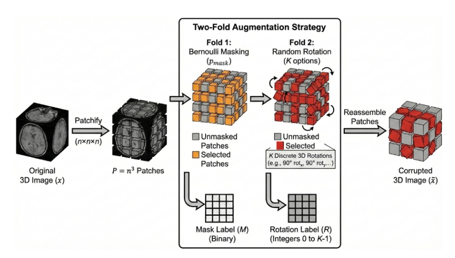

# Two-Fold
Code for "Two-Fold Patch Perturbation for Efficient Self-Supervised Learning in 3D Medical Imaging" published at IJCAI-ECAI 2026

## Abstract
Self-supervised pre-training has become a key
paradigm for reducing annotation costs in 3D medical imaging, yet many recent approaches rely on complex objectives or incur substantial computational overhead. We propose a simple and efficient self-supervised pre-training framework for 3D medical images based on a two-fold patch-wise perturbation strategy. The method applies Bernoulli patch masking and discrete rotations, and trains a shared encoder with a three-head objective
for reconstruction, perturbation localization, and rotation prediction. This design encourages spatially aware and transferable representations while remaining computationally lightweight. Experiments across diverse segmentation and classification benchmarks, including modality-shift scenarios, demonstrate consistent improvements over general self-supervised baselines and competitive or superior performance compared to recent medical SSL methods, while requiring substantially less memory, computation, and training time than the
state-of-the-art pre-training pipelines.

